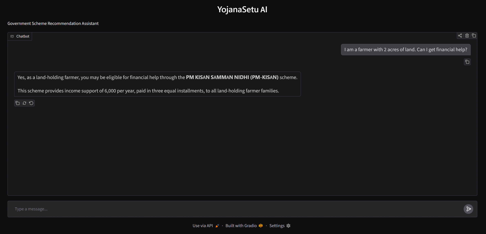
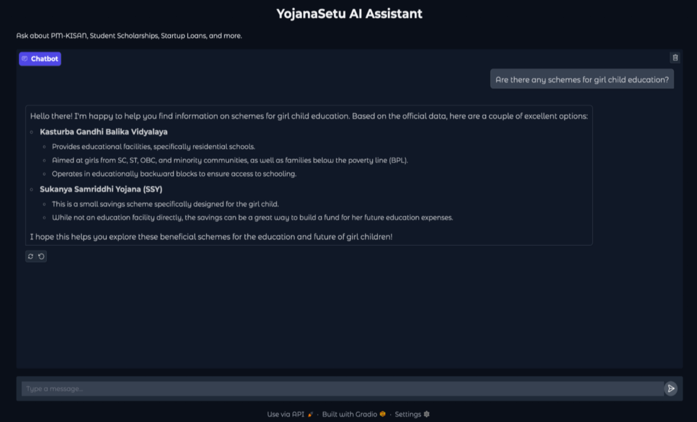

# YojanaSetu AI

An **AI-powered Government Scheme Recommendation System** built using **Retrieval-Augmented Generation (RAG)**. YojanaSetu enables users to discover relevant Indian government welfare schemes through natural language queries by combining **semantic search using SBERT**, **vector similarity search using FAISS**, and **Google Gemini** for intelligent, context-aware recommendations.

---

## 🚀 Features

- 🔍 Semantic search using **Sentence-BERT (SBERT)**
- ⚡ Fast vector similarity search with **FAISS**
- 🤖 Retrieval-Augmented Generation (RAG) architecture
- 💬 Context-aware response generation using **Google Gemini**
- 🌐 Interactive chatbot interface built with **Gradio**
- 📊 Automated evaluation using an **LLM-as-a-Judge** framework

---

## 🏗️ Architecture

- Retrieval-Augmented Generation (RAG)

## 🛠️ Technologies

- Python
- Sentence Transformers (SBERT)
- FAISS
- Google Gemini API
- Gradio
- Pandas
- NumPy

---

## 📊 Dataset

- Initial dataset created by scraping government scheme information from Wikipedia.
- Additional schemes collected manually from official Government PDF documents.
- Removed duplicate and non-scheme entries through manual verification.
- Applied preprocessing including:
  - Text cleaning
  - Whitespace normalization
  - Column standardization
  - Special character removal
- Final curated knowledge base contains **126 verified government schemes**.

---

## 🏗️ Project Workflow

```text
                    User Query
                         │
                         ▼
              SBERT Embedding Generation
                         │
                         ▼
               FAISS Similarity Search
                         │
                         ▼
          Top Relevant Government Schemes
                         │
                         ▼
               Prompt Construction
                         │
                         ▼
               Google Gemini (LLM)
                         │
                         ▼
             Final Recommendation
```

---

## 📸 Project Screenshots

<p align="center">
  
  
</p>

---

## 📂 Project Structure

```text
YojanaSetu-AI/
│
├── app.py                  # Main chatbot application
├── build_index.py          # Creates SBERT embeddings and FAISS vector index
├── data_cleaning.py        # Dataset preprocessing
├── test_retrieval.py       # Tests semantic retrieval
├── evaluate.py             # LLM-as-a-Judge evaluation
├── requirements.txt
├── README.md
├── .gitignore
│
├── data/
│   ├── ConvoProject_CustomMadeDataset.csv
│   └── Final_Govt_Schemes_Dataset.csv
│
├── faiss_store/
│   ├── schemes_faiss.index
│   ├── schemes_data.pkl
│   └── scheme_texts.pkl
│
└── screenshots/
    ├── screenshot_1.png
    └── screenshot_2.png
```

---

## ⚙️ How It Works

1. The user enters a query in natural language.
2. SBERT converts the query into a semantic embedding.
3. FAISS retrieves the most relevant government schemes based on semantic similarity.
4. Retrieved scheme information is provided as context to Google Gemini.
5. Gemini generates a personalized recommendation using the retrieved information.
6. The final response is displayed through a Gradio chatbot interface.

---

## 📈 Evaluation

The chatbot was evaluated using an **LLM-as-a-Judge** framework.

### Evaluation Domains

- 🏠 Housing
- 🎓 Education
- ❤️ Health
- 💼 Business
- 👴 Pension

A separate Gemini instance compared chatbot responses with predefined expected facts and assigned scores on a scale of **1–5**.

**⭐ Average Evaluation Score: 4.60 / 5.0**

---

## 💬 Example Query

```text
I am a farmer with 2 acres of land. Can I get financial help?
```

### Example Response

```text
Recommended Scheme:
PM-KISAN

Benefits:
• ₹6000 annual financial assistance
• Direct Benefit Transfer (DBT)

Reason:
Based on your profile, PM-KISAN is the most suitable scheme for your needs.
```

---

## 📦 Installation

```bash
git clone https://github.com/tisnoork45/YojanaSetu-AI.git

cd YojanaSetu-AI

pip install -r requirements.txt
```

---

## ▶️ Run the Application

```bash
python app.py
```

---

## 🌱 Future Improvements

- 🌍 Multilingual support for regional languages.
- 📡 Integration with official government APIs for real-time scheme updates.
- 👤 Personalized recommendations based on user profiles.
- ☁️ Cloud deployment for public accessibility.
- 📈 Expansion of the knowledge base with additional government schemes.

---

## 👩‍💻 Author

**Tisnoor Kaur**

B.Tech Computer Science Engineering  
Thapar Institute of Engineering & Technology

---


