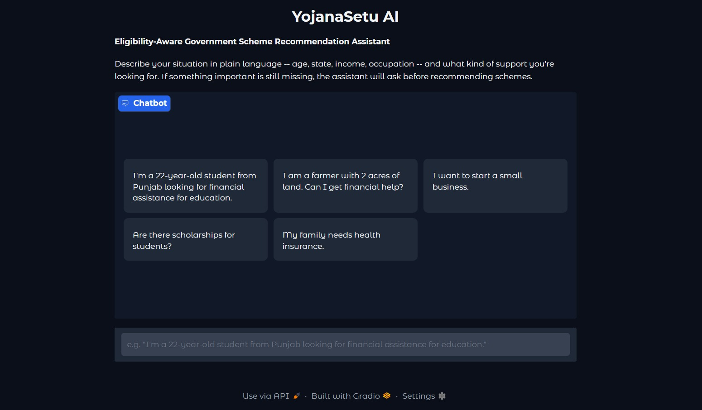
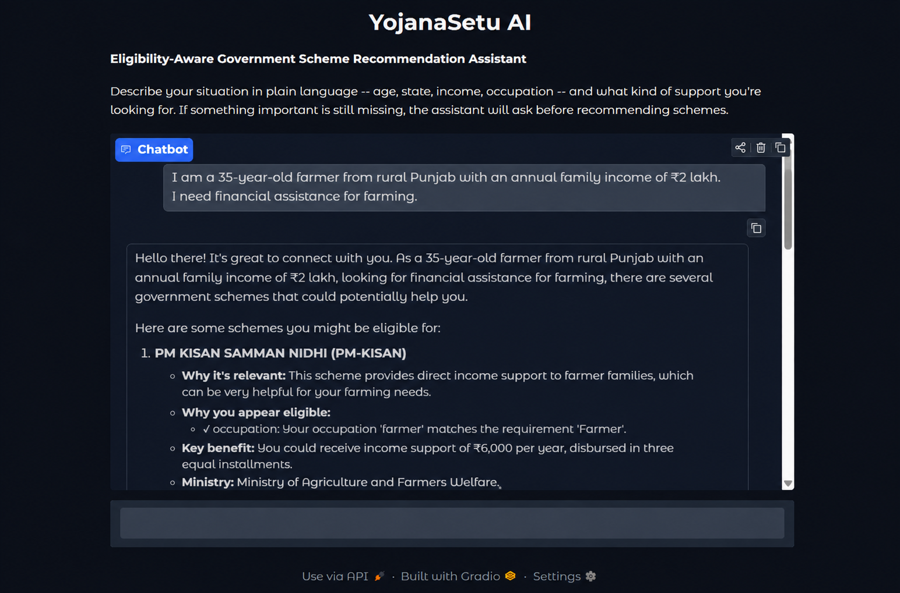

# YojanaSetu AI

An **AI-powered Government Scheme Recommendation System** built using **Retrieval-Augmented Generation (RAG)**. YojanaSetu enables users to discover relevant Indian government welfare schemes through natural language queries by combining **semantic search using SBERT**, **vector similarity search using FAISS**, **deterministic eligibility checking**, and **Google Gemini** for intelligent, context-aware responses.

---

## 🚀 Features

- 🔍 Semantic search using **Sentence-BERT (SBERT)**
- ⚡ Fast vector similarity search with **FAISS**
- 🤖 Retrieval-Augmented Generation (RAG) architecture
- 👤 Natural-language user profile extraction
- 🧠 Automatic intent detection and missing-information handling
- ✅ Deterministic eligibility engine with **ELIGIBLE / NOT_ELIGIBLE / UNKNOWN** states
- 🎯 Similarity threshold-based candidate filtering
- 📊 Candidate ranking based on eligibility and semantic relevance
- 💬 Context-aware response generation using **Google Gemini**
- 🌐 Interactive chatbot interface built with **Gradio**
- 📈 Automated evaluation using **Recall@10, eligibility evaluation, conversational behavior testing, and LLM-as-a-Judge**

---

## 🏗️ Architecture

- Retrieval-Augmented Generation (RAG)
- Semantic Retrieval
- Profile Extraction
- Deterministic Eligibility Reasoning
- LLM-based Response Generation

---

## 🛠️ Technologies

- Python
- Sentence Transformers (SBERT)
- FAISS
- Google Gemini API
- Gradio
- Pandas
- NumPy
- Regular Expressions

---

## 📊 Dataset

- Initial dataset created by scraping government scheme information from Wikipedia.
- Additional schemes collected manually from official Government PDF documents.
- Removed duplicate and non-scheme entries through manual verification.
- Applied preprocessing including:
  - Text cleaning
  - Whitespace normalization
  - Column standardization
  - Special character removal
- Added structured eligibility information such as:
  - Age
  - Gender
  - Occupation
  - Education
  - Rural/Urban status
  - Social category
  - State
- Final curated knowledge base contains **126 verified government schemes**.

---

## 🏗️ Project Workflow

```text
                         User Query
                              │
                              ▼
                  Profile & Intent Extraction
                              │
                              ▼
                   Missing Information Check
                              │
                    ┌─────────┴─────────┐
                    │                   │
                  Missing              Complete
                    │                   │
                    ▼                   ▼
              Follow-up Question   SBERT Embedding
                                        │
                                        ▼
                                FAISS Top-10 Retrieval
                                        │
                                        ▼
                              Similarity Threshold
                                  Filtering
                                        │
                                        ▼
                           Deterministic Eligibility
                                   Engine
                                        │
                              ┌─────────┼─────────┐
                              │         │         │
                          ELIGIBLE   UNKNOWN   NOT_ELIGIBLE
                              │         │         │
                              └─────────┼─────────┘
                                        │
                                        ▼
                               Candidate Ranking
                                        │
                                        ▼
                              Top Recommendations
                                  (Maximum 5)
                                        │
                                        ▼
                              Prompt Construction
                                        │
                                        ▼
                              Google Gemini (LLM)
                                        │
                                        ▼
                              Final Response
                                        │
                                        ▼
                              Gradio Chatbot
```

---

## 📸 Project Screenshots

### Chatbot Interface



### Scheme Recommendations



---

## 📂 Project Structure

```text
YojanaSetu-AI/
│
├── app.py                         # Main chatbot application
├── data_cleaning.py               # Dataset preprocessing
├── enrich_eligibility.py          # Extracts structured eligibility information
├── build_index.py                 # Creates SBERT embeddings and FAISS index
├── profile_extraction.py          # Extracts user profile and detects intent
├── eligibility_engine.py          # Deterministic eligibility checking
├── retrieval_pipeline.py          # Retrieval, filtering and candidate ranking
├── evaluate.py                    # System evaluation and LLM-as-a-Judge
├── generate_eval_dataset.py       # Generates evaluation dataset
├── threshold_validation.py        # Validates similarity threshold
├── test_retrieval.py              # Tests semantic retrieval
├── requirements.txt
├── README.md
├── .gitignore
│
├── data/
│   ├── Final_Govt_Schemes_Dataset.csv
│   ├── Final_Govt_Schemes_Dataset_Enriched.csv
│   └── eval_dataset.json
│
├── faiss_store/
│   ├── schemes_faiss.index
│   ├── schemes_data.pkl
│   └── scheme_texts.pkl
│
├── screenshots/
│   ├── screenshot_1.jpeg
│   ├── screenshot_2.jpeg
│   ├── screenshot_3.png
│   └── screenshot_4.png
│
└── venv/
```

---

## ⚙️ How It Works

1. The user enters a query in natural language.

2. The system extracts available profile information such as **age, gender, income, state, occupation, education, rural/urban status, and social category**.

3. The system detects the user's intent and checks whether important information is missing. If required information is missing, the chatbot asks a targeted follow-up question instead of guessing.

4. SBERT converts the user's query into a **384-dimensional semantic embedding**.

5. FAISS performs similarity search and retrieves the **top 10 candidate schemes**.

6. A similarity threshold filters out candidates that are not sufficiently relevant.

7. The deterministic eligibility engine checks each remaining scheme against the available user profile.

8. Each candidate is classified as:

   - **ELIGIBLE**
   - **NOT_ELIGIBLE**
   - **UNKNOWN**

9. Candidates are ranked with priority given to eligibility status, followed by semantic similarity.

10. Up to **5 relevant candidates** are selected for the final recommendation.

11. The processed scheme information is provided as context to **Google Gemini**.

12. Gemini generates the final natural-language response using only the retrieved and processed scheme information.

13. The final response is displayed through the **Gradio chatbot interface**.

---

## Evaluation

The system was evaluated at different stages to measure retrieval performance, eligibility reasoning, conversational behavior, and generated-answer quality.

### 1. Retrieval Evaluation

The retrieval system was evaluated on **83 retrieval cases** using **Recall@10**.

**Raw Recall@10: 93.98%**

This measures whether the expected government scheme appeared anywhere in the top 10 results returned by FAISS.

### 2. Eligibility Evaluation

The deterministic eligibility engine was evaluated on **83 cases** against the expected eligibility outcomes in the evaluation dataset.

**Eligibility Accuracy: 89.16%**

The evaluation checks whether the system correctly classifies schemes as **ELIGIBLE, NOT_ELIGIBLE, or UNKNOWN** based on the available structured eligibility information.

### 3. Conversational Behavior

The chatbot was also tested for whether it:

- Correctly asks for missing information
- Handles ambiguous requests
- Avoids making eligibility decisions without sufficient information
- Handles low-relevance queries appropriately

### 4. Answer Quality — Gemini-as-a-Judge

Generated responses were evaluated using a separate Gemini-based judge. The judge scores the responses on a **1–5 scale** across four criteria:

| Criterion | Average Score |
|---|---:|
| Relevance | 5.00 / 5 |
| Groundedness | 3.70 / 5 |
| Eligibility Correctness | 4.60 / 5 |
| Overall Quality | 3.60 / 5 |

The LLM-as-a-Judge scores are treated as **answer-quality metrics rather than traditional classification accuracy**.

### 5. Retrieval Threshold Validation

The similarity threshold was also evaluated separately to determine an appropriate operating point for filtering low-relevance queries.

A threshold of **0.30** was selected for the current system. At this threshold:

- **Recall@10: 90.36%**
- **No-match false positives: 0%**

This threshold is an operating point selected for the current evaluation dataset rather than a universal value.

---

## Example Query

> I am a 35-year-old farmer from Punjab with an annual family income of ₹2 lakh. I need financial assistance for farming.

### Example Response

Based on your profile, these government schemes may be relevant:

**1. Pradhan Mantri Kisan Samman Nidhi (PM-KISAN)**

- This scheme provides direct income support to farmer families, which can be helpful for your farming needs.
- You could receive income support of ₹6,000 per year, disbursed in three equal installments.

**2. Kisan Credit Card (KCC)**

- Provides affordable short-term credit for agricultural and related activities.
- May help with expenses such as crop cultivation and other farming needs.

**3. Punjab Crop Residue Management / Farm Mechanization Support**

- Provides support for eligible agricultural machinery and crop-residue-management activities in Punjab.
- May be relevant if you are looking for assistance with farm machinery or residue-management equipment.

---

## 📦 Installation

```bash
git clone https://github.com/tisnoork45/YojanaSetu-AI.git
cd YojanaSetu-AI
pip install -r requirements.txt
```

Create a `.env` file and add your Gemini API key:

```text
GOOGLE_API_KEY=your_api_key_here
```

---

## ▶️ Run the Application

```bash
python app.py
```

The Gradio interface will open in your browser.

---

## 🧪 Running Evaluation

To evaluate retrieval, eligibility, conversational behavior and response quality:

```bash
python evaluate.py
```

To validate the retrieval similarity threshold:

```bash
python threshold_validation.py
```

To test retrieval separately:

```bash
python test_retrieval.py
```

---

## 🌱 Future Improvements

- 🌍 Multilingual support for regional languages.
- 📡 Integration with official government APIs for real-time scheme updates.
- 🧠 LLM-assisted extraction of complex eligibility rules from official documents.
- 🌳 Structured eligibility rule trees supporting complex **AND / OR / NOT** conditions.
- 🔎 Metadata pre-filtering combined with scalable approximate nearest-neighbor search.
- 👤 More detailed personalized recommendations based on user profiles.
- ☁️ Cloud deployment for public accessibility.
- 📈 Expansion of the knowledge base with additional government schemes.
- 🔄 Automatic detection of changes in government scheme eligibility criteria.

---

## 👩‍💻 Author

**Tisnoor Kaur**

B.Tech Computer Science Engineering  
Thapar Institute of Engineering & Technology